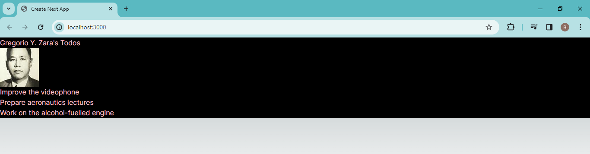

### Laporan Praktikum-3

|  | Pemrograman Berbasis Framework 2024 |
|--|--|
| NIM |  2141720166|
| Nama |  Raihan Dany Radhinnur |
| Kelas | TI - 3I |

### Soal 1
## Ubah isi kode Home() sehingga dapat tampil seperti berikut dengan memanfaatkan komponen Profile() yang tadi sudah dibuat dari langkah 1 tersebut! Capture hasilnya dan buatlah laporan di README.md. Jelaskan apa yang telah Anda pelajari dan bagaimana Anda solve error tersebut? Jangan lupa push dengan pesan commit: "W03: Jawaban soal 1".

Question Answer :

    - In the problem above, what I encountered was that we only need to define the image in the "profile.tsx" file. Here we also set the image size according to what we want. And also what I learned is that it is easy to call the component (here the image in the profile) with the profile function in the "profile.tsx" file.
    

    - The problem I encountered was that it was difficult to display the desired image. The solution I did was to set "next.config.js", delete "port: ", "pathname: " and only use "protocol: " and "hostname: ".

### Soal 2
## Tangkap hasilnya dan buat laporan di README.md. Jelaskan apa yang telah Anda pelajari dan bagaimana tampilannya sekarang? Jangan lupa push dengan pesan komit: "W03: Jawaban pertanyaan 2".

Question Answer :

    In answering this practical 2, I created a "gallery.tsx" component which stores 3 images, and these images are components that I took from "profile.tsx". Then I brought up the "function Gallery" component by importing it into "page.tsx" using the named export method. In below image is an import code that i mention it.

### Soal 3
## Silakan perbaiki kode JSX berikut ini. Anda boleh menggunakan konverter atau perbaiki secara manual. Capture hasilnya dan buatlah laporan di README.md. Jelaskan apa yang telah Anda pelajari dan mengapa error itu bisa terjadi? Jangan lupa push dengan pesan commit: "W03: Jawaban soal 3".

Question Answer :

    In practical work 3 I solved the problem above by changing " div class="info" " with " div className="info" " and also "p class="summary" " with " p className="summary" " This is the correct way to specify a class in JSX, as class is a reserved keyword in JavaScript. and also change the position of </i> with </b>, this is necessary because <i> needs to end directly with </i>.

### Soal 4
## Kode di atas masih terdapat error, silakan diperbaiki. Jangan lupa push dengan pesan commit: "W03: Jawaban soal 4".

Question Answer :

    In working on problem 4, I found an error in " h1 {person}'s Todos /h1 " in the code that wanted to call the data contained in the data " name ". I changed it to " h1 {person.name}'s Todos /h1 " and it works.

### Soal 5
## Buka file src/components/todolist.tsx lakukan ekstrak URL gambar ke dalam objek person. Capture hasilnya dan buatlah laporan di README.md. Apakah ada perbedaan pada tampilan web saat ini? Jangan lupa push dengan pesan commit: "W03: Jawaban soal 5".

Question Answer :

    In practical problem 5, I changed the "src: image" from the "TodoList ()" img function into a "person" object, this I coded with "imageUrl : soruce". It can be seen in the code above, and the results do not have any significant changes.

### Soal 6
## Perbaiki kode tersebut pada bagian atribut src. Kode lainnya dapat Anda sesuaikan dari jawaban soal sebelumnya. Capture hasilnya dan buatlah laporan di README.md. Jelaskan apa yang telah Anda pelajari dan bagaimana tampilannya saat ini? Jangan lupa push dengan pesan commit: "W03: Jawaban soal 6".

Question Answer : 

    In practical question 6, I found an error if I followed the code according to question number 6. I changed it to make "const imgUrl:" which includes "imageId: '7vQD0fP'", "imageSize: 's'" and "const baseUrl = 'https: //i.imgur.com/'". I did this because I thought we couldn't define the source image data directly into image syntax. So I created a const imageUrl that contains all the data from the image source code link and then directly entered it into the " image src: " syntax. You can see the results of my work in the code above.

### Soal 7
## Jika kode di atas terdapat error, silakan diperbaiki. Komponen MyGallery ini berisi dua markup yang sama persis. Ekstraklah menjadi komponen MyProfile untuk mengurangi duplikasi. Anda perlu memilih props apa saja yang akan dikirimkan. Capture hasilnya dan buatlah laporan di README.md. Jelaskan apa yang telah Anda pelajari dan bagaimana tampilannya saat ini? Jangan lupa push dengan pesan commit: "W03: Jawaban soal 7".

Question Anwer :

    In practical question 7 I have an error, I found that the question code above lacked a "utils.tsx" file, this can be seen by the question code which does "import utils.tsx". The solution I provide is to create a code file "utils.tsx" which contains the getImageUrl function which functions to get the required image. Code and results can be seen in the image above.

